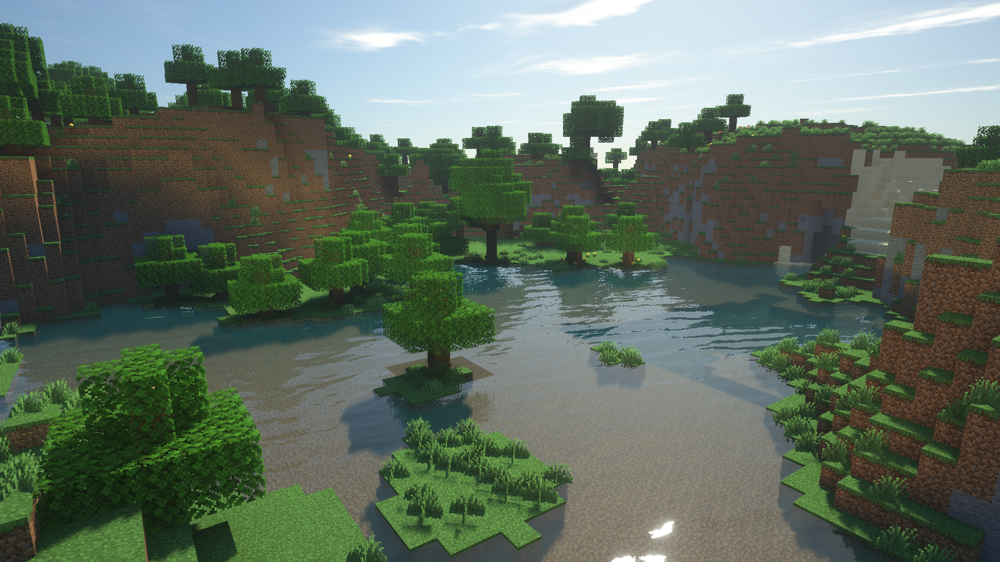
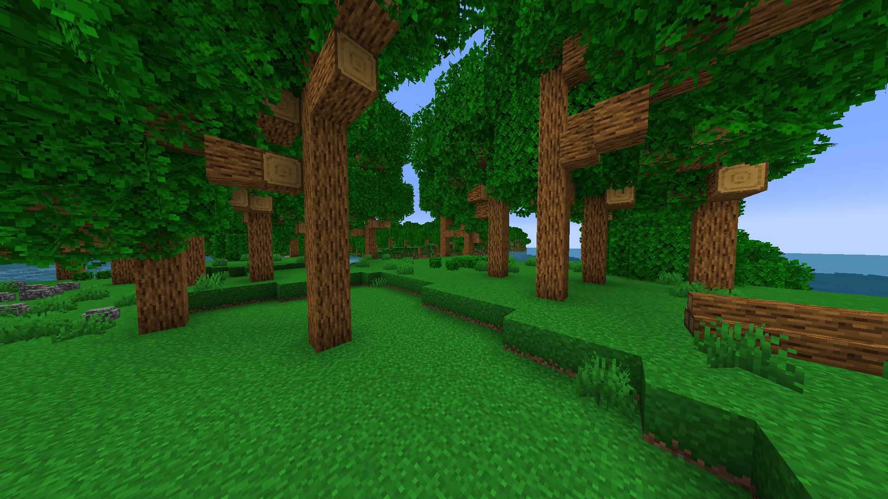

# Hello! 👋

# I'm Sqaaakoi.

### I successfully pretend to know what the code I'm writing actually does.

## About me

- My pronouns are **they/them** 💛🤍💜🖤
- I sometimes make **Minecraft mods** for fun.
- I mostly program in **Java** and occasionally **JavaScript**, due to what I make.

## Projects that I'm currently working on

#### Native Decorations

A Minecraft mod that adds some decorations such as bushes, rocks, piles of logs and more to your worlds.

More is coming soon, such as re-adding the paeonia, and a few biomes too.

Here's a screenshot of the features, such as those rocks, log piles, and a "Big Oak Forest" biome.

(Big Oak Biome is intentionally designed to bring back Beta-like nostalgia.)

This is a single biome world set to `native_decorations:big_oak_forest` 
Seed is `-5526793799177641198`, Version of mod is `0.2`, and time is `4000` ticks 
Coordinates of image are `/execute in minecraft:overworld run tp @s 403.64 71.75 374.59 -222.64 2.49` 

#### Custom minecraft launcher

I'm making a custom Minecraft launcher using Electron sometime soon.

Here's some ideas for it that I have.

- Modular

- Better account system

- Built-in locally stored repository of mods and resource pocks

- Simple format for sharing modpacks

- Better compatibility between launcher and mods running on the client

- A skin changer that automatically detects what model to use, because **I'm tired of going on public Minecraft servers and seeing people who have applied an Alex model skin to the Steve model. It genuinely really annoys me. (Maybe I'll make a client-side mod that automatically fixes other players skins that are displayed to show the correct model.)** 

## Contact me

- **Discord: [Sqaaakoi#8792][social-discord]** (preferred)
- Twitter: [@sqaaakoi][social-twitter]

## You should also know...

- Don't contact me about jobs.

- I really hate NFTs and anything cryptocurrency related. It's been ruined by power hungry GPU mining and being a scam. You can't fix that.

- I sometimes store some of my repositories on my NAS and only push them to GitHub as a mirror. I'll try my best to accept PRs.

<!-- Links -->

[social-discord]: https://discord.com/users/259558259491340288
[social-twitter]: https://twitter.com/sqaaakoi
